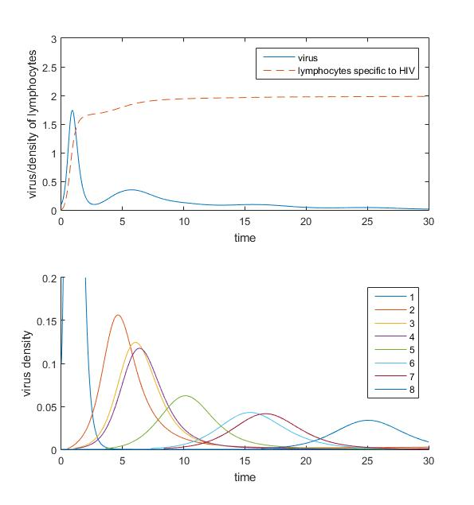

A Mathematical Model of HIV Infections and Vaccination against the Development of AIDS
====

Final project for the course Mathematical Modeling in the Life Sciences.

## Abstract

The human immunodeficiency virus (HIV) is a retrovirus that at-
tacks human's immune system and leads to the consequent disease
AIDS. Major features after the infection of HIV include salient anti-
genic variation of the virus and a long incubation period (on average
8-10 years) before AIDS is finally induced. These features are close-
ly associated with some features of HIV, the most important one of
which may be the high mutation capability of the virus.
Martin A. Nowak and Robert M. May studied the mathematical
model of antigenic variation and diversiry threshold during HIV infec-
tions, which was published on a paper in 1991 [1]. Later, on the basis
of this model, Nowak and Angela R. Mclean discussed and analyzed
the vaccination against HIV mathematically [2]. In our work, we will
follow and repeat the most contents of the two papers and have some
discussions about the mathematical model.

## Selected Figures

These figures are basic simulation plots for a dynamic system, modeling lymphocytes fighting against HIVs. In the system, a virus strand may generate other strands (mutants). The above figures are simulated with higher virus birth rate, these viruses finally escape the immune response. In contrast, the below results show that the viruses are eliminated with relatively lower birth rate.

For details and discussions see the [report](paper.pdf).

## References

[1] Nowak M A, May R M. Mathematical biology of HIV infections: antigenic
variation and diversity threshold[J]. Mathematical Biosciences, 1991,
106(1):1-21.

[2] Nowak M A, Mclean A R. A mathematical model of vaccination against
HIV to prevent the development of AIDS.[J]. Proceedings of the Royal
Society B Biological Sciences, 1991, 246(1316):141-6.
